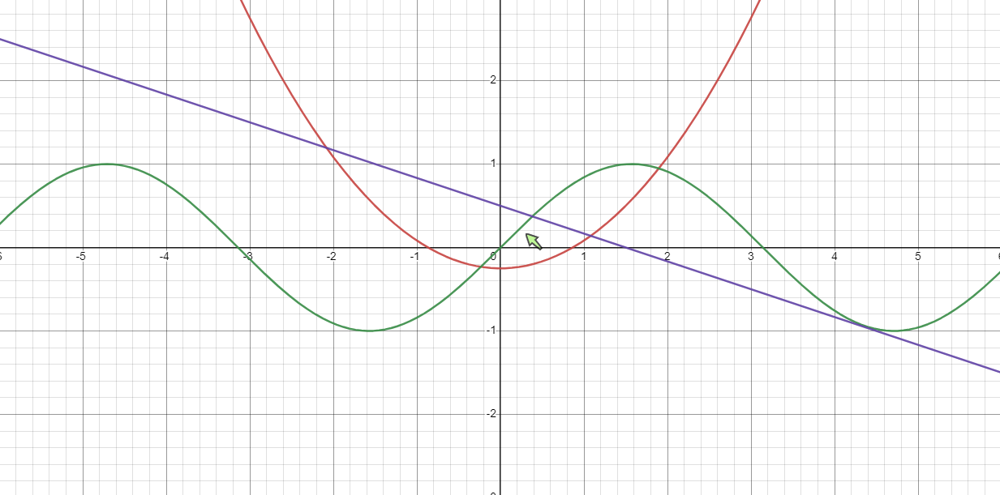

# Multiplayer Desmos

It's [Desmos](https://desmos.com/calculator/), but multiplayer.

## Usage

Go to `https://graph.xacer/dev/app` and click "Invite others". An invite link will appear - copy and send this link to your friends. The equations and cursor positions will be synced across participant's browsers.

## Features

The main priorities of Multiplayer Desmos are **ease-of-use** and a **familiar user interface**. Speed is important, too - but it's not like it's written in Rust.

## Purpose

Multiplayer Desmos was created as a tool for math tutors on [Schoolhouse.world](https://schoolhouse.world/), a platform that provides free peer tutoring.

My hypothesis is that if students are given a way to interact in an online tutoring session beyond language (talking, chatting), then tutors can more effectively create an active learning environment because students can act instead of replying "I understand."

## Engineering

I used the Desmos API for the graph, [Y.js](https://github.com/yjs/yjs) as a peer-to-peer CRDT, and I hosted a signaling server myself.

The frontend is created with SvelteKit and Tailwind CSS.